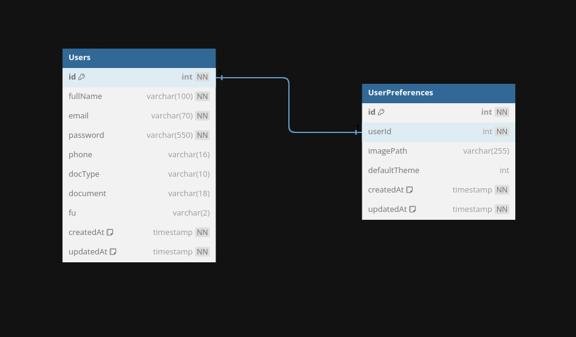

# Spring Back-End Boilerplate :fire:

## Description

Java Domain-Driven Design Boilerplate with Spring Framework for Back-End.

## Overview

#### What to do if the service goes down

- Check the logs;
- Test the dependencies and execution locally;
- Run automated tests;
- If necessary, merge with a hotfix on git;
- Rebuild the project and restart the service;

## Architecture

[Back-End Architecture](https://google.com)  

<div align='center'>
<br>
<a href='https://dbdiagram.io/d/6338e5857b3d2034ff03a8c4'>

<br>
DataBase Diagram
</a>
</div>

## Main technologies

- **Java**: programming laguage;
	* _JDK_: Java Development Kit (compiler, runtime, VM...);
- **Maven**: Java project manager;
- **Spring Framework**: Multi-task framework that can be used for:
	* _Boot_: Spring initial setup;
	* _Web_: HTTP server creation and consume;
	* _JPA_: SQL and NoSQL databases management by abstraction;
- **PostgreSQL**: Relational database;
- **Log4J**: Custom logger with appenders;
- **Docker**: Services isolation and process resources management with containers;
- **Junit**: Testing framework;

To run this project, is recomended to use [JDK version 17](https://www.oracle.com/java/technologies/javase/jdk17-archive-downloads.html) or higher installed and these libraries: [Apache Kafka 3.4.0](https://downloads.apache.org/kafka/3.4.0/RELEASE_NOTES.html) and [Apache Maven 3.5.0](https://maven.apache.org/docs/3.5.0/release-notes.html).  
This project has created using:  
```sh
# create Maven project
$ mvn archetype:generate -DgroupId=com.flightmanager -DartifactId=Flight_Manager_System -DarchetypeVersion=1.4 -DinteractiveMode=false
```

---

### Install dependencies

1. Install project dependencies  
```shell
# install dependencies
$ mvn install

# reinstall dependencies
$ mvn dependency:purge-local-repository

# recompile project
$ mvn clean compile
```

2. Install AWS CLI  
[AWS CLI](https://docs.aws.amazon.com/cli/latest/userguide/getting-started-install.html)

3. Configure AWS CLI
```shell
$ aws configure
> AWS Access Key ID [****]: mock
> AWS Secret Access Key [****]: mock
> Default region name [us-east-1]: us-east-1
> Default output format [table]: json
```

### Execution Steps

1. Start Docker containers;
1. Mock external services;
1. Creat database entities and populat registers;
1. Start HTTP REST API;
1. Start TCP WebSocket;
1. Send message to Queue;
1. Receive message from Queue;

## Environment Preparation

1. Copy dotenv file  
```shell
cp envs/.env.development.local ./.env # copy development local example
source ./.env # load envs on shell session
```

2. Initialize the composefile (`docker-compose.yml`) available on project root folder.

```shell
# create and run essentials docker containers in background
docker-compose up -d database zookeeper kafka
# or
# create and run all docker containers in background
docker-compose up -d

# delete all containers and volumes
docker-compose down -v
```

## Running Locally

After installing the JDK, you can run the project by typing the following commands in terminal:  

```sh
# run project
$ mvn exec:java -Dexec.args="arg1 arg2 arg3"

# run tests
$ mvn test

# create JAR file
$ mvn package
```

## Running Apache Kafka

```sh
$ zookeeper-server-start infra/zookeeper/zookeeper.properties # start Zookeeper server manager
$ kafka-server-start infra/kafka/server.properties # start Kafka server
$ kafka-topics --bootstrap-server=localhost:9092 --create --topic=topic01 --partitions=3 --replication-factor=1 # create Kafka topic
$ kafka-console-producer --bootstrap-server=localhost:9092 --topic=topic01 --property="parse.key=true" --property="key.separator=:" # create Kafka producer

$ kafka-console-consumer --bootstrap-server=localhost:9092 --topic=topic01 --group=G1 # create Kafka consumer (with group)

$ kafka-topics --bootstrap-server=localhost:9092 --list # list topics
$ kafka-topics --bootstrap-server=localhost:9092 --describe --topic=topic01 # get topic details
$ kafka-consumer-groups.sh --bootstrap-server=localhost:9092 --list # list consumers groups
$ kafka-consumer-groups.sh --bootstrap-server=localhost:9092 -—describe --group=G1 # get consumers group details
```

## Interface

- [localhost:3000](`http://localhost:3000/`) - Application Interface (API)  
  * `/` - WebSocket Root Endpoint
  * `/api` - REST Root Endpoint
  	- `/api/docs` - Swagger API Documentation (Page)
- [localhost:4000](`http://localhost:4000/`) - Mocked Service Page  
- [localhost:8080](`http://localhost:8080/`) - Adminer Page  
- [localhost:8080](`http://localhost:9000/`) - Kafdrop Page  

___

...
